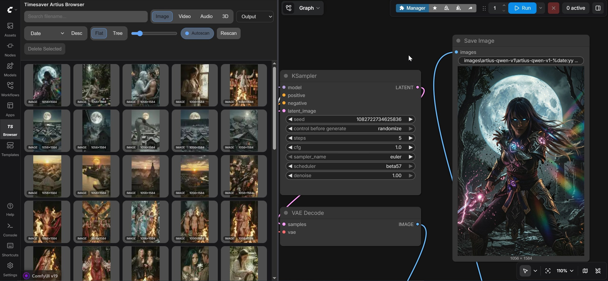

<div align="center">

# 🎨 Artius Browser for ComfyUI

**A fast, friendly sidebar for the files you actually use every day.**


🇬🇧 [English](#english) ·
🇷🇺 [Русский](#russian) ·
🇪🇸 [Español](#spanish) ·
🇨🇳 [中文](#chinese) ·
🇯🇵 [日本語](#japanese) ·
🇰🇷 [한국어](#korean) ·
🇩🇪 [Deutsch](#german) ·
🇮🇹 [Italiano](#italian) ·
🇫🇷 [Français](#french) ·
🇵🇹 [Português](#portuguese)



</div>

---

<a id="english"></a>

## 🇬🇧 English

> **Artius Browser** lives in your ComfyUI sidebar and makes it painless to find,
> preview, drag, and load assets — images, videos, audio, 3D models, and
> workflow files. It stays fast on huge libraries and uses native ComfyUI
> behavior wherever it can.

### ✨ Highlights

| | |
|---|---|
| 🖼️ **Images** | Cached thumbnails, PNG prompt + workflow extraction, lightbox with wipe / 2×2 grid compare |
| 🎬 **Videos** | Frame-stepping, codec / FPS / duration / audio info, sync compare for 2 or 4 clips |
| 🎵 **Audio** | Waveform preview, transport controls, channel layout |
| 🎲 **3D** | Native ComfyUI 3D viewer in the lightbox, captured 3D thumbnails |
| 📜 **Workflows** | Reads ComfyUI's native workflow folder, sidecar previews, drag-to-load |
| 🪟 **Two tabs** | `Assets` and `Workflows` with **independent** state (search, sort, view, preview size, tree-panel width) |
| 🔍 **Filename-only search** | Fast, predictable, no surprise full-text scans |
| 🚀 **Drag-and-drop** | Direct into native `LoadImage` / `LoadVideo` / `LoadAudio` / `Load3D` nodes |
| 🗑️ **Safe delete** | Sends to system trash via `send2trash` — never hard-delete |
| 🔄 **Autoscan / Rebuild Cache** | Refresh on demand, or rebuild from scratch |
| 🏷️ **Version label + update badge** | Current version next to the title; checks GitHub once a day, surfaces a `New version available` chip when a newer release ships |

### 📁 Supported formats

- 🖼️ Images: `.png` · `.jpg` · `.jpeg` · `.webp` · `.avif`
- 🎬 Videos: `.mp4` · `.mov` · `.webm` · `.prores`
- 🎵 Audio: `.mp3` · `.wav` · `.flac` · `.opus` · `.ogg`
- 🎲 3D: `.glb` · `.obj`
- 📜 Workflows: `.json`

### 🚀 Quick start

#### Recommended — via Comfy Registry

```bash
comfy node install timesaver-artius-browser
```

…or search **Timesaver Artius Browser** in **ComfyUI Manager**.

#### Manual install

```bash
git clone https://github.com/AlexYez/comfyui-artius-browser \
  ComfyUI/custom_nodes/comfyui-artius-browser
pip install -r ComfyUI/custom_nodes/comfyui-artius-browser/requirements.txt
```

Then **restart ComfyUI** and **hard refresh** the browser with `Ctrl+F5`.

> 💡 Make sure `ffmpeg` and `ffprobe` are on your `PATH` — videos and audio need them for full metadata and waveforms.

### ⌨️ Keyboard shortcuts

#### On asset cards

| Key | Action |
|:---:|---|
| <kbd>P</kbd> | Copy prompt |
| <kbd>W</kbd> | Copy workflow *(only when the PNG actually has workflow data)* |
| <kbd>D</kbd> | Download |
| <kbd>X</kbd> | Send to system trash *(only where the root allows deletion)* |

#### On workflow cards

| Key | Action |
|:---:|---|
| <kbd>L</kbd> · double-click | Load workflow into ComfyUI |
| <kbd>D</kbd> | Download workflow JSON |
| <kbd>X</kbd> | Trash workflow + matching preview sidecars |

### 🎯 Native ComfyUI integration

This pack doesn't reinvent loaders — it routes drag-and-drop to native nodes:

| Asset type | Native node |
|---|---|
| Image | `LoadImage` |
| Video | `LoadVideo` |
| Audio | `LoadAudio` |
| 3D | `Load 3D & Animation` / `Load3D` |
| Workflow | Native frontend workflow loader |

3D files are staged into ComfyUI input storage so the native 3D nodes see them
exactly like files picked from the node UI. The `Workflows` tab reads
`user/default/workflows` directly — no separate cache, no parallel index.

### 🔬 Lightbox tour

<details>
<summary><strong>🖼️ Images</strong></summary>

- Mouse-wheel zoom, left/middle-button pan
- 2-image **wipe** compare with a left-to-right slider
- 4-image **2×2 grid** compare
- Separate `Prompt` and `Negative Prompt` panels
- One-click `Copy Workflow` when the PNG carries it
- Open in new tab, download, delete

</details>

<details>
<summary><strong>🎬 Videos</strong></summary>

- Inline playback with current-frame display
- ⬅️ / ➡️ frame-stepping
- Codec, FPS, duration, bitrate, format, audio-track info
- Sync compare for 2 or 4 selected videos with one shared transport

</details>

<details>
<summary><strong>🎵 Audio</strong></summary>

- Waveform preview
- Playback controls
- Duration · bitrate · codec · channel layout

</details>

<details>
<summary><strong>🎲 3D</strong></summary>

- Native ComfyUI 3D viewer in-lightbox
- Technical model info in the sidebar
- No fake texture-sheet stand-in — it's the real thing

</details>

### 🧠 PNG metadata rules

- **Prompt** is read **only** from the PNG `Prompt` field
- **Workflow** is read **only** from the PNG `Workflow` field
- Positive and negative prompts are split before display
- If positive and negative are identical, only the positive is shown
- *Seed is no longer stored*

### 🛡️ Compatibility & safety

- Drag-and-drop graph access goes through a thin Comfy adapter — current
  canvas APIs preferred, legacy `LiteGraph` paths isolated.
- Asset search is filename-focused. Unsupported `metadata` query params
  return `400 Bad Request` instead of silently doing nothing.
- Asset listing pagination is **keyset-based** (`after_sort` + `after_id`);
  deep pages are O(1) regardless of library size.
- Companion images (PNG sidecars whose stem matches a sibling video / audio
  / 3D asset) are suppressed via a stored flag, not a query-time subquery.
- Frontend listeners are explicitly torn down on stage close / worker stop.

### ⚡ Performance notes

- Filename-only search · compact metadata · compact preview cache
- Virtualized grid · keyset pagination · stale-while-revalidate response cache
  *(LRU 10, 30 s TTL)* for instant filter / sort re-toggles
- Frontend-only workflow browsing · frontend-generated 3D thumbnails persisted to disk
- `ffprobe` + `ffmpeg` run **in parallel per asset** (single Popen pair)
- Worker pools default to `max(1, min(4, cpu_count() // 2))` — tweak in `config.json`
- Video poster: ffmpeg pre-downscales the captured frame so PIL only LANCZOS-finishes a small image
- WebP previews are written with `method=0` (fastest, visually identical at thumbnail sizes)
- Preview URLs carry the cached file's `mtime` as a cache-buster — no hard refresh after Rebuild Cache
- Optional accelerators:
  - 🚀 `Pillow-SIMD` — drop-in Pillow replacement, **4–6×** faster image thumbnailing
  - 🚀 `blake3` — already in `requirements.txt`, avoids the slower `blake2b` fallback

### 🆘 Troubleshooting

<details>
<summary><strong>Some previews look stale</strong></summary>

Hit **Rebuild Cache**. Preview URLs auto-bust the browser cache via an `mtime` token, so a hard refresh is usually unnecessary. If it still looks stale, restart ComfyUI and `Ctrl+F5`.

</details>

<details>
<summary><strong>Video or audio metadata is missing</strong></summary>

You probably don't have `ffmpeg` / `ffprobe` on `PATH`. Install them and restart.

</details>

<details>
<summary><strong>I want a complete reset</strong></summary>

Delete `ComfyUI/output/.ts_artius_browser/`, restart ComfyUI, scan again. All previews and indexes will rebuild.

</details>

### 🗂️ Runtime layout

```
ComfyUI/output/.ts_artius_browser/
├── db.sqlite          # asset index
├── config.json        # UI + tools settings (schema v16)
└── cache/
    ├── thumbnails/
    ├── video_frames/
    ├── waveforms/
    └── placeholders/
```

### 🧪 Release checks

```bash
python scripts/check_release.py
```

Validates Python syntax · JS syntax · JSON · localization keys · dead helpers · 179 unit tests · git whitespace.

Optional, against a running ComfyUI:

```bash
pytest tests/integration -v             # 18 HTTP route tests
cd tests/e2e && npx playwright test     # 5 native node ID + version smoke tests
```

### 📋 Changelog

See [CHANGELOG.md](CHANGELOG.md). Format: [Keep a Changelog](https://keepachangelog.com/en/1.1.0/).

---

<a id="russian"></a>

## 🇷🇺 Русский

> **Artius Browser** живёт в боковой панели ComfyUI и делает работу с
> ассетами — картинками, видео, аудио, 3D и workflow — простой и быстрой.
> Хорошо себя ведёт на больших библиотеках, везде где можно — использует
> нативное поведение ComfyUI.

### ✨ Главное

| | |
|---|---|
| 🖼️ **Картинки** | Кэш-превью, чтение PNG `Prompt` + `Workflow`, лайтбокс с wipe / 2×2 grid сравнением |
| 🎬 **Видео** | Покадровая навигация, кодек / FPS / длительность / инфо аудиодорожки, синхронное сравнение 2 или 4 клипов |
| 🎵 **Аудио** | Waveform-превью, плеер, channel layout |
| 🎲 **3D** | Нативный 3D viewer в лайтбоксе, фронтенд-сгенерированные 3D-thumbnail'ы |
| 📜 **Workflows** | Читает нативную папку workflow, sidecar-превью, drag-to-load |
| 🪟 **Две вкладки** | `Assets` и `Workflows` с **независимыми** настройками |
| 🔍 **Поиск по имени** | Быстро и предсказуемо, без сюрпризов |
| 🚀 **Drag-and-drop** | Прямо в нативные `LoadImage` / `LoadVideo` / `LoadAudio` / `Load3D` |
| 🗑️ **Безопасное удаление** | В системную корзину через `send2trash`, не навсегда |
| 🔄 **Autoscan / Rebuild Cache** | Обновление по запросу или полная пересборка |
| 🏷️ **Версия + бейдж обновления** | Текущая версия рядом с заголовком; раз в сутки проверяется GitHub, появляется чип `New version available` при выходе нового релиза |

### 🚀 Установка

#### Рекомендуется — через Comfy Registry

```bash
comfy node install timesaver-artius-browser
```

…или ищите **Timesaver Artius Browser** в **ComfyUI Manager**.

#### Вручную

```bash
git clone https://github.com/AlexYez/comfyui-artius-browser \
  ComfyUI/custom_nodes/comfyui-artius-browser
pip install -r ComfyUI/custom_nodes/comfyui-artius-browser/requirements.txt
```

Перезапустите ComfyUI и сделайте hard refresh `Ctrl+F5`.

> 💡 Убедитесь, что `ffmpeg` и `ffprobe` доступны в `PATH` — без них видео и аудио не получат полные метаданные.

### ⌨️ Горячие клавиши

#### На карточке ассета

| Клавиша | Действие |
|:---:|---|
| <kbd>P</kbd> | Скопировать `Prompt` |
| <kbd>W</kbd> | Скопировать workflow *(только если PNG реально содержит workflow)* |
| <kbd>D</kbd> | Скачать |
| <kbd>X</kbd> | В системную корзину *(только там, где root разрешает удаление)* |

#### На карточке workflow

| Клавиша | Действие |
|:---:|---|
| <kbd>L</kbd> · двойной клик | Загрузить в ComfyUI |
| <kbd>D</kbd> | Скачать JSON |
| <kbd>X</kbd> | В корзину workflow + sidecar-превью |

### 🛡️ Совместимость

- Доступ к graph / canvas / LiteGraph проходит через adapter — новые API ComfyUI и legacy fallback не расползаются по UI-коду
- Поиск ассетов — по имени файла; неподдерживаемый query-параметр `metadata` возвращает `400 Bad Request`
- Пагинация keyset-based (`after_sort` + `after_id`) — глубокие страницы стоят столько же, сколько первая
- Companion-картинки (PNG-сайдкары к видео / аудио / 3D с тем же stem) скрываются через сохранённый флаг, без подзапросов в query-time
- Frontend listeners снимаются при закрытии stage / остановке worker

### ⚡ Производительность

- Поиск по имени · компактные метаданные · компактный preview-кэш
- Virtualized grid · keyset pagination · stale-while-revalidate cache *(LRU 10, TTL 30 сек)*
- `ffprobe` + `ffmpeg` параллельно на каждом ассете (один pair Popen)
- Worker pools по умолчанию `max(1, min(4, cpu_count() // 2))` — настраивается в `config.json`
- ffmpeg сразу downscale-ит кадр видео до 2× размера превью, PIL только финиширует LANCZOS
- WebP-превью пишутся с `method=0` (быстрейшее кодирование, визуально идентично на превью)
- URL превью содержит `mtime` как cache-busting токен — после Rebuild Cache hard refresh не нужен
- Опционально:
  - 🚀 `Pillow-SIMD` — drop-in замена Pillow, **4–6×** ускорение thumbnail
  - 🚀 `blake3` — уже в `requirements.txt`, обходит более медленный `blake2b`

### 🆘 Troubleshooting

<details>
<summary><strong>Превью выглядят устаревшими</strong></summary>

Нажмите **Rebuild Cache**. URL превью автоматически инвалидируют HTTP-кэш браузера через `mtime` токен. Если всё равно стейл — перезапустите ComfyUI + `Ctrl+F5`.

</details>

<details>
<summary><strong>Не показываются метаданные видео / аудио</strong></summary>

Проверьте, что `ffmpeg` и `ffprobe` есть в `PATH`. Установите и перезапустите.

</details>

<details>
<summary><strong>Полный сброс</strong></summary>

Удалите `ComfyUI/output/.ts_artius_browser/`, перезапустите ComfyUI, отсканируйте заново.

</details>

### 📋 Changelog

История релизов — в [CHANGELOG.md](CHANGELOG.md). Формат: [Keep a Changelog](https://keepachangelog.com/en/1.1.0/).

---

<a id="spanish"></a>

## 🇪🇸 Español

> **Artius Browser** vive en la barra lateral de ComfyUI y hace que encontrar,
> previsualizar, arrastrar y cargar tus assets — imágenes, vídeos, audios,
> modelos 3D y workflows — sea rápido e indoloro. Se mantiene ágil incluso
> con bibliotecas enormes y usa el comportamiento nativo de ComfyUI siempre
> que puede.

### ✨ Características principales

| | |
|---|---|
| 🖼️ **Imágenes** | Miniaturas cacheadas, extracción de `Prompt` + `Workflow` del PNG, lightbox con comparación wipe / 2×2 |
| 🎬 **Vídeos** | Navegación cuadro a cuadro, info de códec / FPS / duración / audio, comparación sincronizada de 2 o 4 clips |
| 🎵 **Audio** | Previsualización de forma de onda, controles de transporte, layout de canales |
| 🎲 **3D** | Viewer 3D nativo de ComfyUI dentro del lightbox, miniaturas 3D capturadas |
| 📜 **Workflows** | Lee la carpeta de workflows nativa de ComfyUI, previews sidecar, drag-to-load |
| 🪟 **Dos pestañas** | `Assets` y `Workflows` con estado **independiente** (búsqueda, orden, vista, tamaño de preview, ancho del panel árbol) |
| 🔍 **Búsqueda solo por nombre** | Rápida, predecible, sin escaneos full-text sorpresivos |
| 🚀 **Drag-and-drop** | Directo a los nodos nativos `LoadImage` / `LoadVideo` / `LoadAudio` / `Load3D` |
| 🗑️ **Borrado seguro** | A la papelera del sistema vía `send2trash` — nunca borrado definitivo |
| 🔄 **Autoscan / Rebuild Cache** | Refresco bajo demanda, o reconstrucción desde cero |
| 🏷️ **Etiqueta de versión + chip de actualización** | Versión actual junto al título; comprueba GitHub una vez al día y muestra `New version available` cuando hay una nueva |

### 📁 Formatos soportados

- 🖼️ Imágenes: `.png` · `.jpg` · `.jpeg` · `.webp` · `.avif`
- 🎬 Vídeos: `.mp4` · `.mov` · `.webm` · `.prores`
- 🎵 Audio: `.mp3` · `.wav` · `.flac` · `.opus` · `.ogg`
- 🎲 3D: `.glb` · `.obj`
- 📜 Workflows: `.json`

### 🚀 Instalación

#### Recomendado — vía Comfy Registry

```bash
comfy node install timesaver-artius-browser
```

…o busca **Timesaver Artius Browser** en **ComfyUI Manager**.

#### Instalación manual

```bash
git clone https://github.com/AlexYez/comfyui-artius-browser \
  ComfyUI/custom_nodes/comfyui-artius-browser
pip install -r ComfyUI/custom_nodes/comfyui-artius-browser/requirements.txt
```

Luego **reinicia ComfyUI** y haz un **hard refresh** del navegador con `Ctrl+F5`.

> 💡 Asegúrate de tener `ffmpeg` y `ffprobe` en tu `PATH` — vídeos y audios los necesitan para obtener metadatos completos y formas de onda.

### ⌨️ Atajos de teclado

#### En tarjetas de asset

| Tecla | Acción |
|:---:|---|
| <kbd>P</kbd> | Copiar prompt |
| <kbd>W</kbd> | Copiar workflow *(solo cuando el PNG realmente contiene datos de workflow)* |
| <kbd>D</kbd> | Descargar |
| <kbd>X</kbd> | Enviar a la papelera *(solo donde el root permite borrado)* |

#### En tarjetas de workflow

| Tecla | Acción |
|:---:|---|
| <kbd>L</kbd> · doble clic | Cargar workflow en ComfyUI |
| <kbd>D</kbd> | Descargar JSON del workflow |
| <kbd>X</kbd> | Enviar a la papelera workflow + previews sidecar coincidentes |

### 🎯 Integración nativa con ComfyUI

Este pack no reinventa los loaders — redirige el drag-and-drop a los nodos nativos:

| Tipo de asset | Nodo nativo |
|---|---|
| Imagen | `LoadImage` |
| Vídeo | `LoadVideo` |
| Audio | `LoadAudio` |
| 3D | `Load 3D & Animation` / `Load3D` |
| Workflow | Loader nativo de workflows del frontend |

Los archivos 3D se preparan automáticamente en el almacenamiento de input de ComfyUI para que los nodos 3D nativos los vean exactamente como archivos seleccionados desde la UI del nodo. La pestaña `Workflows` lee `user/default/workflows` directamente — sin caché separado, sin índice paralelo.

### 🔬 Recorrido por el lightbox

<details>
<summary><strong>🖼️ Imágenes</strong></summary>

- Zoom con rueda del ratón, paneo con botón izquierdo/medio
- Comparación **wipe** de 2 imágenes con slider izquierda-derecha
- Comparación **grid 2×2** de 4 imágenes
- Paneles separados para `Prompt` y `Negative Prompt`
- `Copy Workflow` en un clic cuando el PNG lo lleva
- Abrir en nueva pestaña, descargar, borrar

</details>

<details>
<summary><strong>🎬 Vídeos</strong></summary>

- Reproducción inline con visualización del cuadro actual
- ⬅️ / ➡️ navegación cuadro a cuadro
- Códec, FPS, duración, bitrate, formato, info de pista de audio
- Comparación sincronizada de 2 o 4 vídeos seleccionados con un transporte compartido

</details>

<details>
<summary><strong>🎵 Audio</strong></summary>

- Previsualización de forma de onda
- Controles de reproducción
- Duración · bitrate · códec · layout de canales

</details>

<details>
<summary><strong>🎲 3D</strong></summary>

- Viewer 3D nativo de ComfyUI dentro del lightbox
- Información técnica del modelo en la barra lateral
- Sin sustitutos de texturas falsas — es el modelo real

</details>

### 🧠 Reglas de metadatos PNG

- **Prompt** se lee **solo** del campo `Prompt` del PNG
- **Workflow** se lee **solo** del campo `Workflow` del PNG
- Los prompts positivos y negativos se separan antes de mostrarse
- Si positivo y negativo son idénticos, solo se muestra el positivo
- *El seed ya no se almacena*

### 🛡️ Compatibilidad y seguridad

- El acceso al graph para drag-and-drop pasa por un adaptador delgado de Comfy — se prefieren las APIs actuales del canvas, los caminos legacy de `LiteGraph` quedan aislados.
- La búsqueda de assets se centra en el nombre del archivo. Parámetros de query `metadata` no soportados devuelven `400 Bad Request` en vez de fallar silenciosamente.
- La paginación del listado de assets es **keyset-based** (`after_sort` + `after_id`); las páginas profundas son O(1) sin importar el tamaño de la biblioteca.
- Las imágenes companion (sidecars PNG cuyo stem coincide con un asset hermano de vídeo / audio / 3D) se ocultan mediante un flag almacenado, no mediante subquery en tiempo de consulta.
- Los listeners del frontend se desmontan explícitamente al cerrar el stage / detener el worker.

### ⚡ Notas de rendimiento

- Búsqueda solo por nombre · metadatos compactos · caché de previews compacto
- Grid virtualizado · paginación keyset · caché stale-while-revalidate *(LRU 10, TTL 30 s)* para re-toggles instantáneos de filtro / orden
- Navegación de workflows solo en frontend · miniaturas 3D generadas en frontend y persistidas en disco
- `ffprobe` + `ffmpeg` corren **en paralelo por asset** (un único par Popen)
- Worker pools por defecto `max(1, min(4, cpu_count() // 2))` — ajustable en `config.json`
- Póster de vídeo: ffmpeg pre-downscale el cuadro capturado para que PIL solo termine con LANCZOS una imagen pequeña
- Previews WebP se escriben con `method=0` (más rápido, visualmente idéntico en tamaño thumbnail)
- Las URLs de preview llevan el `mtime` del archivo cacheado como cache-buster — no hace falta hard refresh tras Rebuild Cache
- Aceleradores opcionales:
  - 🚀 `Pillow-SIMD` — reemplazo drop-in de Pillow, thumbnailing de imágenes **4–6×** más rápido
  - 🚀 `blake3` — ya en `requirements.txt`, evita el fallback más lento `blake2b`

### 🆘 Solución de problemas

<details>
<summary><strong>Algunas previews se ven desactualizadas</strong></summary>

Pulsa **Rebuild Cache**. Las URLs de preview invalidan la caché del navegador automáticamente vía un token `mtime`, así que normalmente no hace falta hard refresh. Si sigue mal, reinicia ComfyUI y `Ctrl+F5`.

</details>

<details>
<summary><strong>Faltan metadatos de vídeo o audio</strong></summary>

Probablemente no tienes `ffmpeg` / `ffprobe` en `PATH`. Instálalos y reinicia.

</details>

<details>
<summary><strong>Quiero un reset completo</strong></summary>

Borra `ComfyUI/output/.ts_artius_browser/`, reinicia ComfyUI, escanea de nuevo. Todas las previews e índices se reconstruirán.

</details>

### 🗂️ Layout en runtime

```
ComfyUI/output/.ts_artius_browser/
├── db.sqlite          # índice de assets
├── config.json        # ajustes de UI + herramientas (schema v16)
└── cache/
    ├── thumbnails/
    ├── video_frames/
    ├── waveforms/
    └── placeholders/
```

### 🧪 Comprobaciones de release

```bash
python scripts/check_release.py
```

Valida sintaxis Python · sintaxis JS · JSON · claves de localización · helpers muertos · 179 tests unitarios · whitespace de git.

Opcionalmente, contra un ComfyUI en marcha:

```bash
pytest tests/integration -v             # 18 tests de rutas HTTP
cd tests/e2e && npx playwright test     # 5 smoke tests: IDs de nodos nativos + versión
```

### 📋 Changelog

Consulta [CHANGELOG.md](CHANGELOG.md). Formato: [Keep a Changelog](https://keepachangelog.com/en/1.1.0/).

---

<a id="chinese"></a>

## 🇨🇳 中文

> **Artius Browser** 驻留在 ComfyUI 的侧边栏中，让你轻松查找、预览、拖拽
> 和加载各种素材 — 图片、视频、音频、3D 模型和 workflow 文件。即使面对超大
> 规模的资产库也能保持流畅，并尽可能使用 ComfyUI 的原生行为。

### ✨ 主要特性

| | |
|---|---|
| 🖼️ **图片** | 缩略图缓存、提取 PNG 中的 `Prompt` 与 `Workflow`、灯箱支持 wipe / 2×2 网格对比 |
| 🎬 **视频** | 逐帧导航、显示编码器 / FPS / 时长 / 音频信息、2 或 4 个剪辑的同步对比 |
| 🎵 **音频** | 波形预览、播放控制、声道布局 |
| 🎲 **3D** | 灯箱中嵌入 ComfyUI 原生 3D 查看器、自动捕获 3D 缩略图 |
| 📜 **Workflows** | 直接读取 ComfyUI 原生 workflow 文件夹、sidecar 预览、拖拽即可加载 |
| 🪟 **双标签页** | `Assets` 与 `Workflows` 拥有**独立**状态(搜索、排序、视图、预览大小、树面板宽度) |
| 🔍 **仅按文件名搜索** | 快速、可预期、不会出现意外的全文扫描 |
| 🚀 **拖拽** | 直接拖入原生 `LoadImage` / `LoadVideo` / `LoadAudio` / `Load3D` 节点 |
| 🗑️ **安全删除** | 通过 `send2trash` 移至系统回收站 — 永不硬删除 |
| 🔄 **自动扫描 / 重建缓存** | 按需刷新或从零重建 |
| 🏷️ **版本标签 + 更新提示** | 标题旁显示当前版本;每天检查一次 GitHub,新版本发布时显示 `New version available` |

### 📁 支持的格式

- 🖼️ 图片:`.png` · `.jpg` · `.jpeg` · `.webp` · `.avif`
- 🎬 视频:`.mp4` · `.mov` · `.webm` · `.prores`
- 🎵 音频:`.mp3` · `.wav` · `.flac` · `.opus` · `.ogg`
- 🎲 3D:`.glb` · `.obj`
- 📜 Workflow:`.json`

### 🚀 快速开始

#### 推荐 — 通过 Comfy Registry

```bash
comfy node install timesaver-artius-browser
```

…或在 **ComfyUI Manager** 中搜索 **Timesaver Artius Browser**。

#### 手动安装

```bash
git clone https://github.com/AlexYez/comfyui-artius-browser \
  ComfyUI/custom_nodes/comfyui-artius-browser
pip install -r ComfyUI/custom_nodes/comfyui-artius-browser/requirements.txt
```

然后**重启 ComfyUI**并使用 `Ctrl+F5` 进行**强制刷新**。

> 💡 请确保 `ffmpeg` 和 `ffprobe` 在你的 `PATH` 中 — 视频和音频需要它们才能获取完整的元数据与波形。

### ⌨️ 快捷键

#### 资产卡片上

| 按键 | 操作 |
|:---:|---|
| <kbd>P</kbd> | 复制 prompt |
| <kbd>W</kbd> | 复制 workflow *(仅当 PNG 真正包含 workflow 数据时)* |
| <kbd>D</kbd> | 下载 |
| <kbd>X</kbd> | 移至系统回收站 *(仅在 root 允许删除的位置)* |

#### Workflow 卡片上

| 按键 | 操作 |
|:---:|---|
| <kbd>L</kbd> · 双击 | 加载到 ComfyUI |
| <kbd>D</kbd> | 下载 workflow JSON |
| <kbd>X</kbd> | 将 workflow 与匹配的预览 sidecar 移至回收站 |

### 🎯 ComfyUI 原生集成

本扩展不重新发明 loader — 它将拖拽路由到原生节点:

| 资产类型 | 原生节点 |
|---|---|
| 图片 | `LoadImage` |
| 视频 | `LoadVideo` |
| 音频 | `LoadAudio` |
| 3D | `Load 3D & Animation` / `Load3D` |
| Workflow | 原生前端 workflow 加载器 |

3D 文件会自动暂存到 ComfyUI 的 input 存储中,这样原生 3D 节点看到它们的方式就和从节点 UI 中选择的文件完全一样。`Workflows` 标签页直接读取 `user/default/workflows` — 没有独立缓存,没有并行索引。

### 🔬 灯箱概览

<details>
<summary><strong>🖼️ 图片</strong></summary>

- 鼠标滚轮缩放、左/中键平移
- 2 张图片的 **wipe** 对比,带左右滑块
- 4 张图片的 **2×2 网格**对比
- `Prompt` 与 `Negative Prompt` 独立面板
- 当 PNG 包含 workflow 时,一键 `Copy Workflow`
- 在新标签页打开、下载、删除

</details>

<details>
<summary><strong>🎬 视频</strong></summary>

- 内联播放并显示当前帧
- ⬅️ / ➡️ 逐帧导航
- 编码器、FPS、时长、比特率、格式、音轨信息
- 选中的 2 或 4 个视频可同步对比,共享一个传输控件

</details>

<details>
<summary><strong>🎵 音频</strong></summary>

- 波形预览
- 播放控制
- 时长 · 比特率 · 编码器 · 声道布局

</details>

<details>
<summary><strong>🎲 3D</strong></summary>

- 灯箱中嵌入 ComfyUI 原生 3D 查看器
- 侧边栏显示模型的技术信息
- 没有伪造的贴图替代品 — 这是真实的 3D 模型

</details>

### 🧠 PNG 元数据规则

- **Prompt** **只**从 PNG 的 `Prompt` 字段读取
- **Workflow** **只**从 PNG 的 `Workflow` 字段读取
- 正向与负向 prompt 在显示前会被分离
- 如果正向与负向相同,只显示正向
- *Seed 不再被存储*

### 🛡️ 兼容性与安全

- 拖拽时对 graph 的访问通过一个轻量的 Comfy 适配器 — 优先使用当前 canvas API,旧版 `LiteGraph` 路径被隔离。
- 资产搜索专注于文件名。不支持的 `metadata` query 参数会返回 `400 Bad Request` 而不是静默无效。
- 资产列表的分页是 **keyset-based** (`after_sort` + `after_id`); 无论库的大小如何,深页都是 O(1)。
- Companion 图片(stem 与同目录视频 / 音频 / 3D 资产相匹配的 PNG sidecar)通过存储的标记隐藏,而不是查询时的子查询。
- 前端 listener 在 stage 关闭 / worker 停止时显式拆除。

### ⚡ 性能说明

- 仅按文件名搜索 · 紧凑的元数据 · 紧凑的预览缓存
- 虚拟化网格 · keyset 分页 · stale-while-revalidate 响应缓存 *(LRU 10, TTL 30 秒)* 让筛选/排序的反复切换即时响应
- 前端独立的 workflow 浏览 · 前端生成并持久化到磁盘的 3D 缩略图
- 每个资产的 `ffprobe` + `ffmpeg` **并行运行**(单个 Popen 对)
- Worker pool 默认 `max(1, min(4, cpu_count() // 2))` — 可在 `config.json` 中调整
- 视频海报:ffmpeg 预先缩小捕获的帧,PIL 只用 LANCZOS 完成一张小图
- WebP 预览以 `method=0` 写入(最快,在缩略图尺寸下视觉上无差异)
- 预览 URL 携带缓存文件的 `mtime` 作为 cache-buster — 重建缓存后无需 hard refresh
- 可选加速器:
  - 🚀 `Pillow-SIMD` — Pillow 的 drop-in 替代,图片缩略图速度提升 **4–6×**
  - 🚀 `blake3` — 已经在 `requirements.txt` 中,避免较慢的 `blake2b` 回退

### 🆘 故障排查

<details>
<summary><strong>有些预览看起来过时</strong></summary>

点击 **Rebuild Cache**。预览 URL 通过 `mtime` token 自动失效浏览器缓存,所以通常不需要 hard refresh。如果仍然过时,重启 ComfyUI 并 `Ctrl+F5`。

</details>

<details>
<summary><strong>视频或音频元数据缺失</strong></summary>

很可能 `ffmpeg` / `ffprobe` 不在 `PATH` 中。安装它们并重启。

</details>

<details>
<summary><strong>我想完全重置</strong></summary>

删除 `ComfyUI/output/.ts_artius_browser/`,重启 ComfyUI,再次扫描。所有预览和索引将重建。

</details>

### 🗂️ 运行时目录结构

```
ComfyUI/output/.ts_artius_browser/
├── db.sqlite          # 资产索引
├── config.json        # UI + 工具设置 (schema v16)
└── cache/
    ├── thumbnails/
    ├── video_frames/
    ├── waveforms/
    └── placeholders/
```

### 🧪 Release 检查

```bash
python scripts/check_release.py
```

验证 Python 语法 · JS 语法 · JSON · 本地化键 · 死代码 · 179 个单元测试 · git 空白字符。

可选,针对运行中的 ComfyUI:

```bash
pytest tests/integration -v             # 18 个 HTTP 路由测试
cd tests/e2e && npx playwright test     # 5 个原生节点 ID + 版本冒烟测试
```

### 📋 更新日志

参见 [CHANGELOG.md](CHANGELOG.md)。格式:[Keep a Changelog](https://keepachangelog.com/en/1.1.0/)。

---

<a id="japanese"></a>

## 🇯🇵 日本語

> **Artius Browser** は ComfyUI のサイドバーに常駐し、画像・動画・音声・
> 3D モデル・workflow ファイルといったアセットの検索、プレビュー、
> ドラッグ、読み込みを快適にするツールです。大規模なライブラリでも
> 軽快に動作し、可能な限り ComfyUI のネイティブな挙動を利用します。

### ✨ 主な機能

| | |
|---|---|
| 🖼️ **画像** | キャッシュ済みサムネイル、PNG の `Prompt` + `Workflow` 抽出、ライトボックスでの wipe / 2×2 グリッド比較 |
| 🎬 **動画** | フレーム単位のナビゲーション、コーデック / FPS / 長さ / オーディオ情報、2 または 4 クリップの同期比較 |
| 🎵 **音声** | 波形プレビュー、再生コントロール、チャンネルレイアウト |
| 🎲 **3D** | ライトボックス内でネイティブ ComfyUI 3D ビューアー、キャプチャした 3D サムネイル |
| 📜 **Workflows** | ComfyUI ネイティブの workflow フォルダを直接読み込み、サイドカープレビュー、ドラッグで読み込み |
| 🪟 **2 つのタブ** | `Assets` と `Workflows` は**独立した**状態(検索、ソート、表示、プレビューサイズ、ツリーパネル幅)を保持 |
| 🔍 **ファイル名のみ検索** | 高速で予測可能、意図しないフルテキストスキャンなし |
| 🚀 **ドラッグ&ドロップ** | ネイティブ `LoadImage` / `LoadVideo` / `LoadAudio` / `Load3D` ノードに直接 |
| 🗑️ **安全な削除** | `send2trash` 経由でシステムのゴミ箱へ — 完全削除はしません |
| 🔄 **自動スキャン / キャッシュ再構築** | オンデマンドの更新、またはゼロからの再構築 |
| 🏷️ **バージョンラベル + 更新通知** | タイトル横に現在のバージョン;1 日 1 回 GitHub をチェックし、新しいリリースがあれば `New version available` チップを表示 |

### 📁 対応フォーマット

- 🖼️ 画像: `.png` · `.jpg` · `.jpeg` · `.webp` · `.avif`
- 🎬 動画: `.mp4` · `.mov` · `.webm` · `.prores`
- 🎵 音声: `.mp3` · `.wav` · `.flac` · `.opus` · `.ogg`
- 🎲 3D: `.glb` · `.obj`
- 📜 Workflows: `.json`

### 🚀 クイックスタート

#### 推奨 — Comfy Registry 経由

```bash
comfy node install timesaver-artius-browser
```

…または **ComfyUI Manager** で **Timesaver Artius Browser** を検索してください。

#### 手動インストール

```bash
git clone https://github.com/AlexYez/comfyui-artius-browser \
  ComfyUI/custom_nodes/comfyui-artius-browser
pip install -r ComfyUI/custom_nodes/comfyui-artius-browser/requirements.txt
```

その後、**ComfyUI を再起動**し、`Ctrl+F5` でブラウザの**ハードリフレッシュ**を行ってください。

> 💡 `ffmpeg` と `ffprobe` が `PATH` に含まれていることを確認してください — 動画と音声の完全なメタデータと波形にはこれらが必要です。

### ⌨️ キーボードショートカット

#### アセットカード上

| キー | 動作 |
|:---:|---|
| <kbd>P</kbd> | プロンプトをコピー |
| <kbd>W</kbd> | workflow をコピー *(PNG が実際に workflow データを持っている場合のみ)* |
| <kbd>D</kbd> | ダウンロード |
| <kbd>X</kbd> | システムのゴミ箱へ *(root が削除を許可している場所のみ)* |

#### Workflow カード上

| キー | 動作 |
|:---:|---|
| <kbd>L</kbd> · ダブルクリック | ComfyUI に読み込む |
| <kbd>D</kbd> | workflow JSON をダウンロード |
| <kbd>X</kbd> | workflow + 一致するプレビューサイドカーをゴミ箱へ |

### 🎯 ComfyUI ネイティブ統合

この pack は loader を再発明しません — ドラッグ&ドロップをネイティブノードにルーティングします:

| アセット種類 | ネイティブノード |
|---|---|
| 画像 | `LoadImage` |
| 動画 | `LoadVideo` |
| 音声 | `LoadAudio` |
| 3D | `Load 3D & Animation` / `Load3D` |
| Workflow | ネイティブフロントエンド workflow loader |

3D ファイルは ComfyUI の input ストレージに自動的にステージングされ、ネイティブ 3D ノードからは UI で選択したファイルと全く同じように見えます。`Workflows` タブは `user/default/workflows` を直接読み込み — 別キャッシュも並列インデックスもありません。

### 🔬 ライトボックスツアー

<details>
<summary><strong>🖼️ 画像</strong></summary>

- マウスホイールでズーム、左/中ボタンでパン
- 2 枚の画像の **wipe** 比較、左右スライダー付き
- 4 枚の画像の **2×2 グリッド**比較
- `Prompt` と `Negative Prompt` の独立パネル
- PNG に含まれていれば 1 クリックで `Copy Workflow`
- 新しいタブで開く、ダウンロード、削除

</details>

<details>
<summary><strong>🎬 動画</strong></summary>

- インライン再生、現在のフレーム表示付き
- ⬅️ / ➡️ フレーム単位のナビゲーション
- コーデック、FPS、長さ、ビットレート、フォーマット、音声トラック情報
- 選択した 2 または 4 個の動画を、共有トランスポートで同期比較

</details>

<details>
<summary><strong>🎵 音声</strong></summary>

- 波形プレビュー
- 再生コントロール
- 長さ · ビットレート · コーデック · チャンネルレイアウト

</details>

<details>
<summary><strong>🎲 3D</strong></summary>

- ライトボックス内でネイティブ ComfyUI 3D ビューアー
- サイドバーにモデルの技術情報
- 偽のテクスチャシートの代替品ではない — 本物の 3D モデル

</details>

### 🧠 PNG メタデータルール

- **Prompt** は PNG の `Prompt` フィールド**のみ**から読み込み
- **Workflow** は PNG の `Workflow` フィールド**のみ**から読み込み
- ポジティブとネガティブの prompt は表示前に分離
- ポジティブとネガティブが同じ場合、ポジティブのみ表示
- *Seed は保存されなくなりました*

### 🛡️ 互換性と安全性

- ドラッグ&ドロップのグラフアクセスは薄い Comfy アダプタを経由 — 現在の canvas API を優先し、レガシーな `LiteGraph` パスは隔離されます。
- アセット検索はファイル名重視。サポートされていない `metadata` query パラメータは `400 Bad Request` を返します(静かに無視しません)。
- アセット一覧のページネーションは **keyset ベース** (`after_sort` + `after_id`);深いページもライブラリサイズに関係なく O(1) です。
- Companion 画像(動画 / 音声 / 3D アセットと同じ stem を持つ PNG サイドカー)は、クエリ時のサブクエリではなく、保存されたフラグで非表示にします。
- フロントエンドのリスナーは stage クローズ / worker 停止時に明示的に解除されます。

### ⚡ パフォーマンスについて

- ファイル名のみ検索 · コンパクトなメタデータ · コンパクトなプレビューキャッシュ
- 仮想化グリッド · keyset ページネーション · stale-while-revalidate レスポンスキャッシュ *(LRU 10, TTL 30 秒)* でフィルタ / ソートの再切り替えが瞬時に
- フロントエンドのみの workflow ブラウジング · フロントエンド生成の 3D サムネイルはディスクに永続化
- `ffprobe` + `ffmpeg` は**アセットごとに並列実行**(1 つの Popen ペア)
- Worker pool のデフォルトは `max(1, min(4, cpu_count() // 2))` — `config.json` で調整可能
- 動画のポスター: ffmpeg がキャプチャしたフレームを事前にダウンスケールし、PIL は小さな画像を LANCZOS で仕上げるだけ
- WebP プレビューは `method=0` で書き込み(最速、サムネイルサイズでは視覚的に同等)
- プレビュー URL はキャッシュファイルの `mtime` を cache-buster として持つ — Rebuild Cache 後にハードリフレッシュ不要
- オプションのアクセラレータ:
  - 🚀 `Pillow-SIMD` — Pillow のドロップイン置き換え、画像サムネイル化が **4–6×** 高速
  - 🚀 `blake3` — すでに `requirements.txt` に含まれており、遅い `blake2b` フォールバックを回避

### 🆘 トラブルシューティング

<details>
<summary><strong>一部のプレビューが古く見える</strong></summary>

**Rebuild Cache** を押してください。プレビュー URL は `mtime` トークンでブラウザキャッシュを自動的に無効化するので、通常ハードリフレッシュは不要です。それでも古い場合は ComfyUI を再起動し、`Ctrl+F5`。

</details>

<details>
<summary><strong>動画や音声のメタデータが欠けている</strong></summary>

おそらく `ffmpeg` / `ffprobe` が `PATH` にありません。インストールして再起動してください。

</details>

<details>
<summary><strong>完全リセットしたい</strong></summary>

`ComfyUI/output/.ts_artius_browser/` を削除し、ComfyUI を再起動して再スキャンしてください。すべてのプレビューとインデックスが再構築されます。

</details>

### 🗂️ ランタイム構成

```
ComfyUI/output/.ts_artius_browser/
├── db.sqlite          # アセットインデックス
├── config.json        # UI + ツール設定 (schema v16)
└── cache/
    ├── thumbnails/
    ├── video_frames/
    ├── waveforms/
    └── placeholders/
```

### 🧪 リリースチェック

```bash
python scripts/check_release.py
```

Python シンタックス · JS シンタックス · JSON · ローカライズキー · 死コード · 179 ユニットテスト · git 空白を検証します。

オプションで、稼働中の ComfyUI に対して:

```bash
pytest tests/integration -v             # 18 個の HTTP ルートテスト
cd tests/e2e && npx playwright test     # 5 個のネイティブノード ID + バージョン smoke テスト
```

### 📋 変更履歴

[CHANGELOG.md](CHANGELOG.md) を参照してください。フォーマット: [Keep a Changelog](https://keepachangelog.com/en/1.1.0/)。

---

<a id="korean"></a>

## 🇰🇷 한국어

> **Artius Browser**는 ComfyUI 사이드바에 자리잡아 이미지, 비디오, 오디오,
> 3D 모델, workflow 파일 같은 에셋을 빠르게 찾고, 미리보고, 드래그하고,
> 불러올 수 있도록 도와줍니다. 대용량 라이브러리에서도 가볍게 동작하며,
> 가능한 한 ComfyUI 의 네이티브 동작을 사용합니다.

### ✨ 주요 특징

| | |
|---|---|
| 🖼️ **이미지** | 캐시된 썸네일, PNG `Prompt` + `Workflow` 추출, 라이트박스의 wipe / 2×2 그리드 비교 |
| 🎬 **비디오** | 프레임 단위 탐색, 코덱 / FPS / 길이 / 오디오 정보, 2 또는 4 개 클립의 동기화 비교 |
| 🎵 **오디오** | 파형 미리보기, 재생 컨트롤, 채널 레이아웃 |
| 🎲 **3D** | 라이트박스 내 ComfyUI 네이티브 3D 뷰어, 캡처된 3D 썸네일 |
| 📜 **Workflows** | ComfyUI 네이티브 workflow 폴더를 직접 읽음, sidecar 미리보기, 드래그로 로드 |
| 🪟 **두 개의 탭** | `Assets`와 `Workflows`가 **독립적인** 상태(검색, 정렬, 보기, 미리보기 크기, 트리 패널 너비)를 가짐 |
| 🔍 **파일명 검색만** | 빠르고 예측 가능, 의외의 풀텍스트 스캔 없음 |
| 🚀 **드래그 앤 드롭** | 네이티브 `LoadImage` / `LoadVideo` / `LoadAudio` / `Load3D` 노드로 직접 |
| 🗑️ **안전한 삭제** | `send2trash`를 통해 시스템 휴지통으로 — 영구 삭제 안 함 |
| 🔄 **자동 스캔 / 캐시 재구성** | 필요시 새로고침, 또는 처음부터 재구성 |
| 🏷️ **버전 라벨 + 업데이트 칩** | 제목 옆에 현재 버전; GitHub 을 하루 1 회 확인하고 새 릴리스가 있으면 `New version available` 칩 표시 |

### 📁 지원 형식

- 🖼️ 이미지: `.png` · `.jpg` · `.jpeg` · `.webp` · `.avif`
- 🎬 비디오: `.mp4` · `.mov` · `.webm` · `.prores`
- 🎵 오디오: `.mp3` · `.wav` · `.flac` · `.opus` · `.ogg`
- 🎲 3D: `.glb` · `.obj`
- 📜 Workflows: `.json`

### 🚀 빠른 시작

#### 권장 — Comfy Registry 사용

```bash
comfy node install timesaver-artius-browser
```

…또는 **ComfyUI Manager** 에서 **Timesaver Artius Browser** 를 검색하세요.

#### 수동 설치

```bash
git clone https://github.com/AlexYez/comfyui-artius-browser \
  ComfyUI/custom_nodes/comfyui-artius-browser
pip install -r ComfyUI/custom_nodes/comfyui-artius-browser/requirements.txt
```

그 다음 **ComfyUI 를 재시작**하고 브라우저에서 `Ctrl+F5` 로 **하드 새로고침** 하세요.

> 💡 `ffmpeg` 와 `ffprobe` 가 `PATH` 에 있는지 확인하세요 — 비디오와 오디오의 전체 메타데이터와 파형에 필요합니다.

### ⌨️ 키보드 단축키

#### 에셋 카드에서

| 키 | 동작 |
|:---:|---|
| <kbd>P</kbd> | 프롬프트 복사 |
| <kbd>W</kbd> | workflow 복사 *(PNG 에 실제로 workflow 데이터가 있을 때만)* |
| <kbd>D</kbd> | 다운로드 |
| <kbd>X</kbd> | 시스템 휴지통으로 *(root 가 삭제를 허용하는 경우에만)* |

#### Workflow 카드에서

| 키 | 동작 |
|:---:|---|
| <kbd>L</kbd> · 더블 클릭 | ComfyUI 로 불러오기 |
| <kbd>D</kbd> | workflow JSON 다운로드 |
| <kbd>X</kbd> | workflow + 일치하는 미리보기 sidecar 를 휴지통으로 |

### 🎯 ComfyUI 네이티브 통합

이 팩은 loader 를 재발명하지 않습니다 — 드래그 앤 드롭을 네이티브 노드로 라우팅합니다:

| 에셋 유형 | 네이티브 노드 |
|---|---|
| 이미지 | `LoadImage` |
| 비디오 | `LoadVideo` |
| 오디오 | `LoadAudio` |
| 3D | `Load 3D & Animation` / `Load3D` |
| Workflow | 네이티브 프론트엔드 workflow loader |

3D 파일은 ComfyUI 의 input 저장소에 자동으로 스테이징되어, 네이티브 3D 노드에서는 노드 UI 에서 선택한 파일과 정확히 같은 방식으로 보입니다. `Workflows` 탭은 `user/default/workflows` 를 직접 읽습니다 — 별도 캐시도 병렬 인덱스도 없습니다.

### 🔬 라이트박스 둘러보기

<details>
<summary><strong>🖼️ 이미지</strong></summary>

- 마우스 휠 줌, 왼쪽/가운데 버튼 팬
- 2 장 이미지의 **wipe** 비교, 좌우 슬라이더
- 4 장 이미지의 **2×2 그리드** 비교
- `Prompt` 와 `Negative Prompt` 분리 패널
- PNG 가 가지고 있을 때 원클릭 `Copy Workflow`
- 새 탭에서 열기, 다운로드, 삭제

</details>

<details>
<summary><strong>🎬 비디오</strong></summary>

- 인라인 재생 + 현재 프레임 표시
- ⬅️ / ➡️ 프레임 단위 탐색
- 코덱, FPS, 길이, 비트레이트, 형식, 오디오 트랙 정보
- 선택된 2 또는 4 개의 비디오를 공유 transport 로 동기화 비교

</details>

<details>
<summary><strong>🎵 오디오</strong></summary>

- 파형 미리보기
- 재생 컨트롤
- 길이 · 비트레이트 · 코덱 · 채널 레이아웃

</details>

<details>
<summary><strong>🎲 3D</strong></summary>

- 라이트박스 내 ComfyUI 네이티브 3D 뷰어
- 사이드바에 모델의 기술적 정보
- 가짜 텍스처 시트 대용품 없음 — 실제 3D 모델

</details>

### 🧠 PNG 메타데이터 규칙

- **Prompt** 는 PNG `Prompt` 필드**에서만** 읽음
- **Workflow** 는 PNG `Workflow` 필드**에서만** 읽음
- 긍정 / 부정 프롬프트는 표시 전에 분리됨
- 긍정과 부정이 동일하면 긍정만 표시
- *Seed 는 더 이상 저장되지 않음*

### 🛡️ 호환성 및 안전성

- 드래그 앤 드롭 시 graph 접근은 얇은 Comfy 어댑터를 거칩니다 — 현재 canvas API 가 우선시되고, 레거시 `LiteGraph` 경로는 격리됩니다.
- 에셋 검색은 파일명 중심입니다. 지원하지 않는 `metadata` 쿼리 파라미터는 조용히 무시되는 대신 `400 Bad Request` 를 반환합니다.
- 에셋 목록 페이지네이션은 **keyset 기반** (`after_sort` + `after_id`); 라이브러리 크기와 무관하게 깊은 페이지도 O(1) 입니다.
- Companion 이미지(동일 stem 을 가진 비디오 / 오디오 / 3D 에셋의 PNG sidecar)는 쿼리 시점의 서브쿼리가 아닌 저장된 플래그로 숨겨집니다.
- 프론트엔드 리스너는 stage 닫힘 / worker 정지 시 명시적으로 해제됩니다.

### ⚡ 성능 노트

- 파일명 검색만 · 컴팩트한 메타데이터 · 컴팩트한 미리보기 캐시
- 가상화 그리드 · keyset 페이지네이션 · stale-while-revalidate 응답 캐시 *(LRU 10, TTL 30 초)* 로 필터 / 정렬 토글 즉시 반영
- 프론트엔드 전용 workflow 브라우징 · 프론트엔드 생성 3D 썸네일을 디스크에 영구 저장
- `ffprobe` + `ffmpeg` 는 **에셋별로 병렬 실행** (단일 Popen 페어)
- Worker pool 기본값은 `max(1, min(4, cpu_count() // 2))` — `config.json` 에서 조정 가능
- 비디오 포스터: ffmpeg 가 캡처한 프레임을 사전에 다운스케일하고, PIL 은 작은 이미지만 LANCZOS 로 마무리
- WebP 미리보기는 `method=0` 으로 작성됨(가장 빠름, 썸네일 크기에서는 시각적으로 동일)
- 미리보기 URL 은 캐시 파일의 `mtime` 을 cache-buster 로 포함 — Rebuild Cache 후 하드 새로고침 불필요
- 선택적 가속기:
  - 🚀 `Pillow-SIMD` — Pillow 의 드롭인 교체, 이미지 썸네일 처리 **4–6×** 빠름
  - 🚀 `blake3` — 이미 `requirements.txt` 에 있음, 느린 `blake2b` 폴백을 회피

### 🆘 문제 해결

<details>
<summary><strong>일부 미리보기가 오래된 것처럼 보임</strong></summary>

**Rebuild Cache** 를 클릭하세요. 미리보기 URL 은 `mtime` 토큰으로 브라우저 캐시를 자동 무효화하므로 일반적으로 하드 새로고침은 불필요합니다. 그래도 오래된 것처럼 보이면 ComfyUI 를 재시작하고 `Ctrl+F5`.

</details>

<details>
<summary><strong>비디오 또는 오디오 메타데이터가 누락됨</strong></summary>

`ffmpeg` / `ffprobe` 가 `PATH` 에 없을 가능성이 큽니다. 설치하고 재시작하세요.

</details>

<details>
<summary><strong>완전히 리셋하고 싶음</strong></summary>

`ComfyUI/output/.ts_artius_browser/` 를 삭제하고, ComfyUI 를 재시작하고 다시 스캔하세요. 모든 미리보기와 인덱스가 재구성됩니다.

</details>

### 🗂️ 런타임 레이아웃

```
ComfyUI/output/.ts_artius_browser/
├── db.sqlite          # 에셋 인덱스
├── config.json        # UI + 도구 설정 (schema v16)
└── cache/
    ├── thumbnails/
    ├── video_frames/
    ├── waveforms/
    └── placeholders/
```

### 🧪 릴리스 체크

```bash
python scripts/check_release.py
```

Python 문법 · JS 문법 · JSON · 로컬라이제이션 키 · 죽은 헬퍼 · 179 개 유닛 테스트 · git 공백을 검증합니다.

선택적으로, 실행 중인 ComfyUI 에 대해:

```bash
pytest tests/integration -v             # 18 개 HTTP 라우트 테스트
cd tests/e2e && npx playwright test     # 5 개 네이티브 노드 ID + 버전 스모크 테스트
```

### 📋 변경 이력

[CHANGELOG.md](CHANGELOG.md) 를 참조하세요. 형식: [Keep a Changelog](https://keepachangelog.com/en/1.1.0/).

---

<a id="german"></a>

## 🇩🇪 Deutsch

> **Artius Browser** lebt in der Seitenleiste von ComfyUI und macht das Finden,
> Voranzeigen, Ziehen und Laden deiner Assets — Bilder, Videos, Audio,
> 3D-Modelle und Workflow-Dateien — schmerzfrei. Bleibt auch bei riesigen
> Bibliotheken schnell und nutzt wo immer möglich das native Verhalten von ComfyUI.

### ✨ Highlights

| | |
|---|---|
| 🖼️ **Bilder** | Gecachte Thumbnails, Extraktion von PNG `Prompt` + `Workflow`, Lightbox mit Wipe / 2×2-Grid-Vergleich |
| 🎬 **Videos** | Frame-genaue Navigation, Codec- / FPS- / Dauer- / Audio-Infos, synchroner Vergleich von 2 oder 4 Clips |
| 🎵 **Audio** | Waveform-Vorschau, Transport-Steuerung, Channel-Layout |
| 🎲 **3D** | Nativer ComfyUI 3D-Viewer in der Lightbox, automatisch erfasste 3D-Thumbnails |
| 📜 **Workflows** | Liest den nativen Workflow-Ordner von ComfyUI direkt, Sidecar-Previews, Drag-to-Load |
| 🪟 **Zwei Tabs** | `Assets` und `Workflows` mit **unabhängigem** Zustand (Suche, Sortierung, Ansicht, Vorschaugröße, Baumbreite) |
| 🔍 **Suche nur nach Dateiname** | Schnell, vorhersagbar, keine überraschenden Volltextscans |
| 🚀 **Drag-and-Drop** | Direkt in native `LoadImage` / `LoadVideo` / `LoadAudio` / `Load3D`-Nodes |
| 🗑️ **Sicheres Löschen** | In den Systempapierkorb via `send2trash` — niemals endgültig |
| 🔄 **Autoscan / Cache neu aufbauen** | Aktualisierung auf Abruf oder kompletter Neuaufbau |
| 🏷️ **Versionslabel + Update-Chip** | Aktuelle Version neben dem Titel; prüft GitHub einmal täglich und blendet `New version available` ein, wenn eine neuere Version erscheint |

### 📁 Unterstützte Formate

- 🖼️ Bilder: `.png` · `.jpg` · `.jpeg` · `.webp` · `.avif`
- 🎬 Videos: `.mp4` · `.mov` · `.webm` · `.prores`
- 🎵 Audio: `.mp3` · `.wav` · `.flac` · `.opus` · `.ogg`
- 🎲 3D: `.glb` · `.obj`
- 📜 Workflows: `.json`

### 🚀 Schnellstart

#### Empfohlen — via Comfy Registry

```bash
comfy node install timesaver-artius-browser
```

…oder suche nach **Timesaver Artius Browser** im **ComfyUI Manager**.

#### Manuelle Installation

```bash
git clone https://github.com/AlexYez/comfyui-artius-browser \
  ComfyUI/custom_nodes/comfyui-artius-browser
pip install -r ComfyUI/custom_nodes/comfyui-artius-browser/requirements.txt
```

Danach **ComfyUI neu starten** und im Browser mit `Ctrl+F5` einen **Hard Refresh** ausführen.

> 💡 Stelle sicher, dass `ffmpeg` und `ffprobe` in deinem `PATH` liegen — Videos und Audio benötigen sie für vollständige Metadaten und Waveforms.

### ⌨️ Tastaturkürzel

#### Auf Asset-Karten

| Taste | Aktion |
|:---:|---|
| <kbd>P</kbd> | Prompt kopieren |
| <kbd>W</kbd> | Workflow kopieren *(nur wenn das PNG tatsächlich Workflow-Daten enthält)* |
| <kbd>D</kbd> | Herunterladen |
| <kbd>X</kbd> | In den Systempapierkorb *(nur dort, wo das Root das Löschen erlaubt)* |

#### Auf Workflow-Karten

| Taste | Aktion |
|:---:|---|
| <kbd>L</kbd> · Doppelklick | Workflow in ComfyUI laden |
| <kbd>D</kbd> | Workflow-JSON herunterladen |
| <kbd>X</kbd> | Workflow + passende Vorschau-Sidecars in den Papierkorb |

### 🎯 Native ComfyUI-Integration

Dieses Pack erfindet keine Loader neu — es leitet Drag-and-Drop an die nativen Nodes weiter:

| Asset-Typ | Nativer Node |
|---|---|
| Bild | `LoadImage` |
| Video | `LoadVideo` |
| Audio | `LoadAudio` |
| 3D | `Load 3D & Animation` / `Load3D` |
| Workflow | Nativer Frontend-Workflow-Loader |

3D-Dateien werden automatisch in den ComfyUI-Input-Speicher gestaged, sodass native 3D-Nodes sie genauso sehen wie Dateien, die aus der Node-UI ausgewählt wurden. Der `Workflows`-Tab liest direkt `user/default/workflows` — kein separater Cache, kein paralleler Index.

### 🔬 Lightbox-Tour

<details>
<summary><strong>🖼️ Bilder</strong></summary>

- Mausrad-Zoom, Pan mit linker/mittlerer Maustaste
- **Wipe**-Vergleich von 2 Bildern mit links-rechts-Slider
- **2×2-Grid**-Vergleich von 4 Bildern
- Separate `Prompt`- und `Negative Prompt`-Panels
- Ein-Klick-`Copy Workflow`, wenn das PNG ihn mitbringt
- In neuem Tab öffnen, herunterladen, löschen

</details>

<details>
<summary><strong>🎬 Videos</strong></summary>

- Inline-Wiedergabe mit Anzeige des aktuellen Frames
- ⬅️ / ➡️ Frame-für-Frame-Navigation
- Codec, FPS, Dauer, Bitrate, Format, Audio-Track-Infos
- Synchroner Vergleich von 2 oder 4 ausgewählten Videos mit einer gemeinsamen Transport-Steuerung

</details>

<details>
<summary><strong>🎵 Audio</strong></summary>

- Waveform-Vorschau
- Wiedergabesteuerung
- Dauer · Bitrate · Codec · Channel-Layout

</details>

<details>
<summary><strong>🎲 3D</strong></summary>

- Nativer ComfyUI 3D-Viewer in der Lightbox
- Technische Modell-Infos in der Seitenleiste
- Kein falscher Textur-Sheet-Ersatz — das echte Modell

</details>

### 🧠 PNG-Metadaten-Regeln

- **Prompt** wird **ausschließlich** aus dem PNG-Feld `Prompt` gelesen
- **Workflow** wird **ausschließlich** aus dem PNG-Feld `Workflow` gelesen
- Positive und negative Prompts werden vor der Anzeige getrennt
- Sind positive und negative Prompts identisch, wird nur der positive gezeigt
- *Seed wird nicht mehr gespeichert*

### 🛡️ Kompatibilität und Sicherheit

- Der Graph-Zugriff für Drag-and-Drop läuft durch einen dünnen Comfy-Adapter — aktuelle Canvas-APIs werden bevorzugt, Legacy-`LiteGraph`-Pfade sind isoliert.
- Die Asset-Suche fokussiert auf Dateinamen. Nicht unterstützte `metadata`-Query-Parameter liefern `400 Bad Request` statt stiller Wirkungslosigkeit.
- Die Asset-Listen-Paginierung ist **keyset-basiert** (`after_sort` + `after_id`); tiefe Seiten kosten O(1), unabhängig von der Bibliotheksgröße.
- Companion-Bilder (PNG-Sidecars, deren Stamm zu einem benachbarten Video- / Audio- / 3D-Asset passt) werden über ein gespeichertes Flag ausgeblendet, nicht über eine Subquery zur Abfragezeit.
- Frontend-Listener werden beim Schließen des Stages / Stoppen des Workers explizit abgemeldet.

### ⚡ Performance-Notizen

- Suche nur nach Dateiname · kompakte Metadaten · kompakter Vorschau-Cache
- Virtualisiertes Grid · keyset-Paginierung · stale-while-revalidate-Response-Cache *(LRU 10, TTL 30 s)* für sofortiges Umschalten von Filter / Sortierung
- Workflow-Browsing nur im Frontend · Frontend-erzeugte 3D-Thumbnails persistent auf Disk
- `ffprobe` + `ffmpeg` laufen **pro Asset parallel** (ein Popen-Paar)
- Worker-Pools standardmäßig `max(1, min(4, cpu_count() // 2))` — in `config.json` anpassbar
- Video-Poster: ffmpeg skaliert den eingefangenen Frame schon vor, sodass PIL nur ein kleines Bild per LANCZOS finalisiert
- WebP-Previews werden mit `method=0` geschrieben (schnellste Einstellung, visuell identisch bei Thumbnail-Größen)
- Vorschau-URLs tragen den `mtime` der Cache-Datei als Cache-Buster — nach Rebuild Cache ist kein Hard Refresh nötig
- Optionale Beschleuniger:
  - 🚀 `Pillow-SIMD` — Drop-in-Ersatz für Pillow, **4–6×** schnelleres Thumbnailing
  - 🚀 `blake3` — bereits in `requirements.txt`, vermeidet den langsameren `blake2b`-Fallback

### 🆘 Fehlerbehebung

<details>
<summary><strong>Manche Previews wirken veraltet</strong></summary>

Klicke auf **Rebuild Cache**. Vorschau-URLs invalidieren den Browser-Cache automatisch via `mtime`-Token, ein Hard Refresh ist meist unnötig. Falls es weiter veraltet aussieht: ComfyUI neu starten und `Ctrl+F5`.

</details>

<details>
<summary><strong>Video- oder Audio-Metadaten fehlen</strong></summary>

Wahrscheinlich liegen `ffmpeg` / `ffprobe` nicht im `PATH`. Installiere sie und starte neu.

</details>

<details>
<summary><strong>Ich möchte komplett zurücksetzen</strong></summary>

Lösche `ComfyUI/output/.ts_artius_browser/`, starte ComfyUI neu, scanne erneut. Alle Previews und Indizes werden neu aufgebaut.

</details>

### 🗂️ Laufzeit-Layout

```
ComfyUI/output/.ts_artius_browser/
├── db.sqlite          # Asset-Index
├── config.json        # UI- + Tool-Einstellungen (Schema v16)
└── cache/
    ├── thumbnails/
    ├── video_frames/
    ├── waveforms/
    └── placeholders/
```

### 🧪 Release-Checks

```bash
python scripts/check_release.py
```

Prüft Python-Syntax · JS-Syntax · JSON · Lokalisierungsschlüssel · tote Helfer · 179 Unit-Tests · Git-Whitespace.

Optional, gegen ein laufendes ComfyUI:

```bash
pytest tests/integration -v             # 18 HTTP-Routen-Tests
cd tests/e2e && npx playwright test     # 5 Smoke-Tests: native Node-IDs + Version
```

### 📋 Changelog

Siehe [CHANGELOG.md](CHANGELOG.md). Format: [Keep a Changelog](https://keepachangelog.com/en/1.1.0/).

---

<a id="italian"></a>

## 🇮🇹 Italiano

> **Artius Browser** vive nella barra laterale di ComfyUI e rende indolore
> trovare, anteprimare, trascinare e caricare i tuoi asset — immagini, video,
> audio, modelli 3D e file di workflow. Rimane reattivo anche con librerie
> enormi e usa il comportamento nativo di ComfyUI ovunque possibile.

### ✨ Caratteristiche principali

| | |
|---|---|
| 🖼️ **Immagini** | Miniature in cache, estrazione di `Prompt` + `Workflow` dal PNG, lightbox con confronto wipe / 2×2 |
| 🎬 **Video** | Navigazione frame per frame, info su codec / FPS / durata / audio, confronto sincronizzato di 2 o 4 clip |
| 🎵 **Audio** | Anteprima della forma d'onda, controlli di riproduzione, layout dei canali |
| 🎲 **3D** | Viewer 3D nativo di ComfyUI nel lightbox, miniature 3D catturate |
| 📜 **Workflows** | Legge la cartella di workflow nativa di ComfyUI, anteprime sidecar, drag-to-load |
| 🪟 **Due tab** | `Assets` e `Workflows` con stato **indipendente** (ricerca, ordinamento, vista, dimensione anteprima, larghezza pannello albero) |
| 🔍 **Ricerca solo per nome** | Veloce, prevedibile, nessuna scansione full-text a sorpresa |
| 🚀 **Drag-and-drop** | Direttamente nei nodi nativi `LoadImage` / `LoadVideo` / `LoadAudio` / `Load3D` |
| 🗑️ **Eliminazione sicura** | Inviato al cestino di sistema tramite `send2trash` — mai eliminato definitivamente |
| 🔄 **Autoscan / Ricostruzione cache** | Aggiornamento on-demand, o ricostruzione da zero |
| 🏷️ **Etichetta versione + chip aggiornamento** | Versione corrente accanto al titolo; controlla GitHub una volta al giorno e mostra `New version available` quando esce una nuova release |

### 📁 Formati supportati

- 🖼️ Immagini: `.png` · `.jpg` · `.jpeg` · `.webp` · `.avif`
- 🎬 Video: `.mp4` · `.mov` · `.webm` · `.prores`
- 🎵 Audio: `.mp3` · `.wav` · `.flac` · `.opus` · `.ogg`
- 🎲 3D: `.glb` · `.obj`
- 📜 Workflows: `.json`

### 🚀 Avvio rapido

#### Consigliato — via Comfy Registry

```bash
comfy node install timesaver-artius-browser
```

…oppure cerca **Timesaver Artius Browser** in **ComfyUI Manager**.

#### Installazione manuale

```bash
git clone https://github.com/AlexYez/comfyui-artius-browser \
  ComfyUI/custom_nodes/comfyui-artius-browser
pip install -r ComfyUI/custom_nodes/comfyui-artius-browser/requirements.txt
```

Poi **riavvia ComfyUI** e fai un **hard refresh** del browser con `Ctrl+F5`.

> 💡 Assicurati che `ffmpeg` e `ffprobe` siano nel tuo `PATH` — video e audio ne hanno bisogno per metadati completi e forme d'onda.

### ⌨️ Scorciatoie da tastiera

#### Su card di asset

| Tasto | Azione |
|:---:|---|
| <kbd>P</kbd> | Copia prompt |
| <kbd>W</kbd> | Copia workflow *(solo quando il PNG contiene davvero dati di workflow)* |
| <kbd>D</kbd> | Scarica |
| <kbd>X</kbd> | Invia al cestino di sistema *(solo dove il root permette l'eliminazione)* |

#### Su card di workflow

| Tasto | Azione |
|:---:|---|
| <kbd>L</kbd> · doppio clic | Carica workflow in ComfyUI |
| <kbd>D</kbd> | Scarica JSON del workflow |
| <kbd>X</kbd> | Sposta workflow + anteprime sidecar corrispondenti nel cestino |

### 🎯 Integrazione nativa con ComfyUI

Questo pack non reinventa i loader — instrada il drag-and-drop ai nodi nativi:

| Tipo di asset | Nodo nativo |
|---|---|
| Immagine | `LoadImage` |
| Video | `LoadVideo` |
| Audio | `LoadAudio` |
| 3D | `Load 3D & Animation` / `Load3D` |
| Workflow | Loader nativo del frontend |

I file 3D vengono automaticamente messi in staging nello storage di input di ComfyUI, così i nodi 3D nativi li vedono esattamente come file selezionati dall'UI del nodo. Il tab `Workflows` legge direttamente `user/default/workflows` — nessuna cache separata, nessun indice parallelo.

### 🔬 Tour del lightbox

<details>
<summary><strong>🖼️ Immagini</strong></summary>

- Zoom con rotella del mouse, pan con pulsante sinistro/centrale
- Confronto **wipe** di 2 immagini con slider sinistra-destra
- Confronto **grid 2×2** di 4 immagini
- Pannelli separati per `Prompt` e `Negative Prompt`
- `Copy Workflow` in un click quando il PNG lo contiene
- Apri in una nuova tab, scarica, elimina

</details>

<details>
<summary><strong>🎬 Video</strong></summary>

- Riproduzione inline con visualizzazione del frame corrente
- ⬅️ / ➡️ navigazione frame per frame
- Codec, FPS, durata, bitrate, formato, info traccia audio
- Confronto sincronizzato di 2 o 4 video selezionati con un transport condiviso

</details>

<details>
<summary><strong>🎵 Audio</strong></summary>

- Anteprima della forma d'onda
- Controlli di riproduzione
- Durata · bitrate · codec · layout canali

</details>

<details>
<summary><strong>🎲 3D</strong></summary>

- Viewer 3D nativo di ComfyUI nel lightbox
- Informazioni tecniche del modello nella sidebar
- Niente texture-sheet finto come surrogato — è il modello reale

</details>

### 🧠 Regole metadati PNG

- **Prompt** viene letto **solo** dal campo `Prompt` del PNG
- **Workflow** viene letto **solo** dal campo `Workflow` del PNG
- Prompt positivi e negativi sono separati prima della visualizzazione
- Se positivo e negativo sono identici, viene mostrato solo il positivo
- *Il seed non è più memorizzato*

### 🛡️ Compatibilità e sicurezza

- L'accesso al graph per il drag-and-drop passa attraverso un adapter sottile di Comfy — le API attuali del canvas sono preferite, i percorsi legacy di `LiteGraph` sono isolati.
- La ricerca degli asset è focalizzata sul nome del file. Parametri di query `metadata` non supportati restituiscono `400 Bad Request` invece di fallire silenziosamente.
- La paginazione dell'elenco asset è **keyset-based** (`after_sort` + `after_id`); pagine profonde sono O(1) indipendentemente dalla dimensione della libreria.
- Le immagini companion (sidecar PNG il cui stem corrisponde a un asset video / audio / 3D adiacente) vengono nascoste tramite un flag memorizzato, non tramite subquery a query-time.
- I listener del frontend vengono smontati esplicitamente alla chiusura dello stage / arresto del worker.

### ⚡ Note sulle performance

- Ricerca solo per nome · metadati compatti · cache delle anteprime compatta
- Grid virtualizzata · paginazione keyset · cache stale-while-revalidate *(LRU 10, TTL 30 s)* per scambi istantanei di filtro / ordinamento
- Browsing dei workflow solo nel frontend · miniature 3D generate dal frontend e persistenti su disco
- `ffprobe` + `ffmpeg` girano **in parallelo per asset** (una sola coppia di Popen)
- Worker pool di default `max(1, min(4, cpu_count() // 2))` — modificabile in `config.json`
- Poster video: ffmpeg riduce in anticipo la dimensione del frame catturato, PIL si limita a finire una piccola immagine con LANCZOS
- Anteprime WebP scritte con `method=0` (più veloce, visivamente identico a dimensioni thumbnail)
- Le URL delle anteprime portano l'`mtime` del file in cache come cache-buster — nessun hard refresh necessario dopo Rebuild Cache
- Acceleratori opzionali:
  - 🚀 `Pillow-SIMD` — sostituzione drop-in di Pillow, thumbnail delle immagini **4–6×** più veloci
  - 🚀 `blake3` — già in `requirements.txt`, evita il fallback più lento `blake2b`

### 🆘 Risoluzione problemi

<details>
<summary><strong>Alcune anteprime sembrano vecchie</strong></summary>

Premi **Rebuild Cache**. Le URL delle anteprime invalidano automaticamente la cache del browser tramite un token `mtime`, quindi normalmente un hard refresh non serve. Se sembra ancora vecchio, riavvia ComfyUI e `Ctrl+F5`.

</details>

<details>
<summary><strong>I metadati di video o audio mancano</strong></summary>

Probabilmente `ffmpeg` / `ffprobe` non sono nel `PATH`. Installali e riavvia.

</details>

<details>
<summary><strong>Voglio un reset completo</strong></summary>

Elimina `ComfyUI/output/.ts_artius_browser/`, riavvia ComfyUI, esegui di nuovo la scansione. Tutte le anteprime e gli indici verranno ricostruiti.

</details>

### 🗂️ Layout runtime

```
ComfyUI/output/.ts_artius_browser/
├── db.sqlite          # indice asset
├── config.json        # impostazioni UI + strumenti (schema v16)
└── cache/
    ├── thumbnails/
    ├── video_frames/
    ├── waveforms/
    └── placeholders/
```

### 🧪 Controlli di release

```bash
python scripts/check_release.py
```

Valida sintassi Python · sintassi JS · JSON · chiavi di localizzazione · helper morti · 179 test unitari · whitespace git.

Opzionalmente, contro un ComfyUI in esecuzione:

```bash
pytest tests/integration -v             # 18 test sulle rotte HTTP
cd tests/e2e && npx playwright test     # 5 smoke test su native node ID + versione
```

### 📋 Changelog

Vedi [CHANGELOG.md](CHANGELOG.md). Formato: [Keep a Changelog](https://keepachangelog.com/en/1.1.0/).

---

<a id="french"></a>

## 🇫🇷 Français

> **Artius Browser** vit dans la barre latérale de ComfyUI et rend agréable
> la recherche, la prévisualisation, le glisser-déposer et le chargement de
> vos assets — images, vidéos, audios, modèles 3D et fichiers de workflow.
> Reste rapide même avec d'immenses bibliothèques et utilise le comportement
> natif de ComfyUI partout où c'est possible.

### ✨ Points forts

| | |
|---|---|
| 🖼️ **Images** | Miniatures en cache, extraction de `Prompt` + `Workflow` du PNG, lightbox avec comparaison wipe / 2×2 |
| 🎬 **Vidéos** | Navigation image par image, infos codec / FPS / durée / audio, comparaison synchronisée de 2 ou 4 clips |
| 🎵 **Audio** | Aperçu de la forme d'onde, contrôles de transport, layout des canaux |
| 🎲 **3D** | Viewer 3D natif de ComfyUI dans la lightbox, miniatures 3D capturées |
| 📜 **Workflows** | Lit le dossier de workflows natif de ComfyUI, aperçus sidecar, drag-to-load |
| 🪟 **Deux onglets** | `Assets` et `Workflows` avec un état **indépendant** (recherche, tri, vue, taille des aperçus, largeur du panneau arborescence) |
| 🔍 **Recherche par nom uniquement** | Rapide, prévisible, pas de scan full-text surprise |
| 🚀 **Glisser-déposer** | Directement vers les nœuds natifs `LoadImage` / `LoadVideo` / `LoadAudio` / `Load3D` |
| 🗑️ **Suppression sûre** | Envoyé à la corbeille système via `send2trash` — jamais de suppression définitive |
| 🔄 **Autoscan / Reconstruction du cache** | Rafraîchissement à la demande, ou reconstruction depuis zéro |
| 🏷️ **Étiquette de version + chip de mise à jour** | Version actuelle à côté du titre ; vérifie GitHub une fois par jour et affiche `New version available` quand une nouvelle release sort |

### 📁 Formats pris en charge

- 🖼️ Images : `.png` · `.jpg` · `.jpeg` · `.webp` · `.avif`
- 🎬 Vidéos : `.mp4` · `.mov` · `.webm` · `.prores`
- 🎵 Audio : `.mp3` · `.wav` · `.flac` · `.opus` · `.ogg`
- 🎲 3D : `.glb` · `.obj`
- 📜 Workflows : `.json`

### 🚀 Démarrage rapide

#### Recommandé — via Comfy Registry

```bash
comfy node install timesaver-artius-browser
```

…ou recherchez **Timesaver Artius Browser** dans **ComfyUI Manager**.

#### Installation manuelle

```bash
git clone https://github.com/AlexYez/comfyui-artius-browser \
  ComfyUI/custom_nodes/comfyui-artius-browser
pip install -r ComfyUI/custom_nodes/comfyui-artius-browser/requirements.txt
```

Puis **redémarrez ComfyUI** et faites un **rafraîchissement forcé** du navigateur avec `Ctrl+F5`.

> 💡 Vérifiez que `ffmpeg` et `ffprobe` sont dans votre `PATH` — les vidéos et l'audio en ont besoin pour leurs métadonnées complètes et leurs formes d'onde.

### ⌨️ Raccourcis clavier

#### Sur les cartes d'asset

| Touche | Action |
|:---:|---|
| <kbd>P</kbd> | Copier le prompt |
| <kbd>W</kbd> | Copier le workflow *(uniquement quand le PNG contient vraiment des données de workflow)* |
| <kbd>D</kbd> | Télécharger |
| <kbd>X</kbd> | Envoyer à la corbeille système *(uniquement là où le root autorise la suppression)* |

#### Sur les cartes de workflow

| Touche | Action |
|:---:|---|
| <kbd>L</kbd> · double-clic | Charger le workflow dans ComfyUI |
| <kbd>D</kbd> | Télécharger le JSON du workflow |
| <kbd>X</kbd> | Envoyer à la corbeille le workflow + sidecars d'aperçu correspondants |

### 🎯 Intégration native avec ComfyUI

Ce pack ne réinvente pas les loaders — il route le glisser-déposer vers les nœuds natifs :

| Type d'asset | Nœud natif |
|---|---|
| Image | `LoadImage` |
| Vidéo | `LoadVideo` |
| Audio | `LoadAudio` |
| 3D | `Load 3D & Animation` / `Load3D` |
| Workflow | Loader natif du frontend |

Les fichiers 3D sont automatiquement préparés dans le stockage d'input de ComfyUI, de sorte que les nœuds 3D natifs les voient exactement comme des fichiers sélectionnés depuis l'UI du nœud. L'onglet `Workflows` lit `user/default/workflows` directement — pas de cache séparé, pas d'index parallèle.

### 🔬 Tour de la lightbox

<details>
<summary><strong>🖼️ Images</strong></summary>

- Zoom à la molette, pan avec le bouton gauche/milieu
- Comparaison **wipe** de 2 images avec slider gauche-droite
- Comparaison **grille 2×2** de 4 images
- Panneaux séparés `Prompt` et `Negative Prompt`
- `Copy Workflow` en un clic quand le PNG le contient
- Ouvrir dans un nouvel onglet, télécharger, supprimer

</details>

<details>
<summary><strong>🎬 Vidéos</strong></summary>

- Lecture inline avec affichage de l'image courante
- ⬅️ / ➡️ navigation image par image
- Codec, FPS, durée, débit, format, infos piste audio
- Comparaison synchronisée de 2 ou 4 vidéos sélectionnées avec un transport partagé

</details>

<details>
<summary><strong>🎵 Audio</strong></summary>

- Aperçu de la forme d'onde
- Contrôles de lecture
- Durée · débit · codec · layout des canaux

</details>

<details>
<summary><strong>🎲 3D</strong></summary>

- Viewer 3D natif de ComfyUI dans la lightbox
- Informations techniques du modèle dans la barre latérale
- Pas de feuille de texture factice — c'est le vrai modèle

</details>

### 🧠 Règles des métadonnées PNG

- **Prompt** est lu **uniquement** depuis le champ `Prompt` du PNG
- **Workflow** est lu **uniquement** depuis le champ `Workflow` du PNG
- Les prompts positifs et négatifs sont séparés avant affichage
- Si positif et négatif sont identiques, seul le positif est affiché
- *Le seed n'est plus stocké*

### 🛡️ Compatibilité et sécurité

- L'accès au graph pour le glisser-déposer passe par un adaptateur fin de Comfy — les API actuelles du canvas sont préférées, les chemins legacy de `LiteGraph` sont isolés.
- La recherche d'assets se concentre sur le nom de fichier. Les paramètres de requête `metadata` non pris en charge retournent `400 Bad Request` au lieu d'échouer silencieusement.
- La pagination de la liste d'assets est **keyset-based** (`after_sort` + `after_id`) ; les pages profondes sont en O(1) quelle que soit la taille de la bibliothèque.
- Les images companion (sidecars PNG dont le stem correspond à un asset vidéo / audio / 3D frère) sont masquées via un flag stocké, pas une sous-requête au moment de la requête.
- Les listeners frontend sont démontés explicitement à la fermeture du stage / arrêt du worker.

### ⚡ Notes de performance

- Recherche par nom uniquement · métadonnées compactes · cache d'aperçus compact
- Grille virtualisée · pagination keyset · cache stale-while-revalidate *(LRU 10, TTL 30 s)* pour des bascules instantanées de filtre / tri
- Navigation de workflows uniquement côté frontend · miniatures 3D générées par le frontend et persistées sur disque
- `ffprobe` + `ffmpeg` tournent **en parallèle par asset** (une seule paire Popen)
- Worker pools par défaut `max(1, min(4, cpu_count() // 2))` — ajustable dans `config.json`
- Poster vidéo : ffmpeg réduit d'avance la taille du frame capturé, PIL termine simplement une petite image avec LANCZOS
- Aperçus WebP écrits avec `method=0` (le plus rapide, visuellement identique à la taille thumbnail)
- Les URL d'aperçu portent le `mtime` du fichier en cache comme cache-buster — pas besoin de rafraîchissement forcé après Rebuild Cache
- Accélérateurs optionnels :
  - 🚀 `Pillow-SIMD` — remplacement drop-in de Pillow, miniatures d'images **4–6×** plus rapides
  - 🚀 `blake3` — déjà dans `requirements.txt`, évite le fallback plus lent `blake2b`

### 🆘 Dépannage

<details>
<summary><strong>Certains aperçus paraissent obsolètes</strong></summary>

Cliquez sur **Rebuild Cache**. Les URL d'aperçu invalident le cache du navigateur automatiquement via un token `mtime`, donc un rafraîchissement forcé n'est généralement pas nécessaire. Si ça reste obsolète, redémarrez ComfyUI et `Ctrl+F5`.

</details>

<details>
<summary><strong>Métadonnées vidéo ou audio manquantes</strong></summary>

Vous n'avez probablement pas `ffmpeg` / `ffprobe` dans le `PATH`. Installez-les et redémarrez.

</details>

<details>
<summary><strong>Je veux une remise à zéro complète</strong></summary>

Supprimez `ComfyUI/output/.ts_artius_browser/`, redémarrez ComfyUI, scannez à nouveau. Tous les aperçus et index seront reconstruits.

</details>

### 🗂️ Layout d'exécution

```
ComfyUI/output/.ts_artius_browser/
├── db.sqlite          # index des assets
├── config.json        # paramètres UI + outils (schéma v16)
└── cache/
    ├── thumbnails/
    ├── video_frames/
    ├── waveforms/
    └── placeholders/
```

### 🧪 Vérifications de release

```bash
python scripts/check_release.py
```

Valide la syntaxe Python · la syntaxe JS · le JSON · les clés de localisation · les helpers morts · 179 tests unitaires · les espaces git.

Optionnel, contre un ComfyUI en cours d'exécution :

```bash
pytest tests/integration -v             # 18 tests des routes HTTP
cd tests/e2e && npx playwright test     # 5 smoke tests : IDs de nœuds natifs + version
```

### 📋 Changelog

Voir [CHANGELOG.md](CHANGELOG.md). Format : [Keep a Changelog](https://keepachangelog.com/en/1.1.0/).

---

<a id="portuguese"></a>

## 🇵🇹 Português

> **Artius Browser** vive na barra lateral do ComfyUI e torna indolor
> encontrar, pré-visualizar, arrastar e carregar os teus assets — imagens,
> vídeos, áudios, modelos 3D e ficheiros de workflow. Mantém-se rápido mesmo
> em bibliotecas enormes e usa o comportamento nativo do ComfyUI sempre que
> possível.

### ✨ Destaques

| | |
|---|---|
| 🖼️ **Imagens** | Thumbnails em cache, extracção de `Prompt` + `Workflow` do PNG, lightbox com comparação wipe / 2×2 |
| 🎬 **Vídeos** | Navegação frame a frame, info de codec / FPS / duração / áudio, comparação sincronizada de 2 ou 4 clips |
| 🎵 **Áudio** | Pré-visualização de forma de onda, controlos de reprodução, layout de canais |
| 🎲 **3D** | Viewer 3D nativo do ComfyUI no lightbox, thumbnails 3D capturados |
| 📜 **Workflows** | Lê directamente a pasta nativa de workflows do ComfyUI, previews sidecar, drag-to-load |
| 🪟 **Dois separadores** | `Assets` e `Workflows` com estado **independente** (procura, ordenação, vista, tamanho de preview, largura do painel árvore) |
| 🔍 **Procura apenas por nome** | Rápida, previsível, sem scans full-text surpresa |
| 🚀 **Arrastar e largar** | Directamente para os nós nativos `LoadImage` / `LoadVideo` / `LoadAudio` / `Load3D` |
| 🗑️ **Eliminação segura** | Enviado para o lixo do sistema via `send2trash` — nunca eliminado permanentemente |
| 🔄 **Autoscan / Reconstruir cache** | Refresh on-demand ou reconstrução do zero |
| 🏷️ **Etiqueta de versão + chip de actualização** | Versão actual ao lado do título; verifica o GitHub uma vez por dia e mostra `New version available` quando sai uma versão mais recente |

### 📁 Formatos suportados

- 🖼️ Imagens: `.png` · `.jpg` · `.jpeg` · `.webp` · `.avif`
- 🎬 Vídeos: `.mp4` · `.mov` · `.webm` · `.prores`
- 🎵 Áudio: `.mp3` · `.wav` · `.flac` · `.opus` · `.ogg`
- 🎲 3D: `.glb` · `.obj`
- 📜 Workflows: `.json`

### 🚀 Início rápido

#### Recomendado — via Comfy Registry

```bash
comfy node install timesaver-artius-browser
```

…ou procura **Timesaver Artius Browser** no **ComfyUI Manager**.

#### Instalação manual

```bash
git clone https://github.com/AlexYez/comfyui-artius-browser \
  ComfyUI/custom_nodes/comfyui-artius-browser
pip install -r ComfyUI/custom_nodes/comfyui-artius-browser/requirements.txt
```

Depois **reinicia o ComfyUI** e faz um **hard refresh** no browser com `Ctrl+F5`.

> 💡 Garante que `ffmpeg` e `ffprobe` estão no teu `PATH` — vídeos e áudios precisam deles para metadados completos e formas de onda.

### ⌨️ Atalhos de teclado

#### Em cards de asset

| Tecla | Acção |
|:---:|---|
| <kbd>P</kbd> | Copiar prompt |
| <kbd>W</kbd> | Copiar workflow *(só quando o PNG realmente contém dados de workflow)* |
| <kbd>D</kbd> | Transferir |
| <kbd>X</kbd> | Enviar para o lixo do sistema *(só onde o root permite eliminação)* |

#### Em cards de workflow

| Tecla | Acção |
|:---:|---|
| <kbd>L</kbd> · duplo clique | Carregar workflow no ComfyUI |
| <kbd>D</kbd> | Transferir JSON do workflow |
| <kbd>X</kbd> | Enviar para o lixo o workflow + sidecars de preview correspondentes |

### 🎯 Integração nativa com o ComfyUI

Este pack não reinventa loaders — encaminha drag-and-drop para os nós nativos:

| Tipo de asset | Nó nativo |
|---|---|
| Imagem | `LoadImage` |
| Vídeo | `LoadVideo` |
| Áudio | `LoadAudio` |
| 3D | `Load 3D & Animation` / `Load3D` |
| Workflow | Loader nativo do frontend |

Os ficheiros 3D são automaticamente preparados no armazenamento de input do ComfyUI, para que os nós 3D nativos os vejam exactamente como ficheiros seleccionados a partir da UI do nó. O separador `Workflows` lê directamente `user/default/workflows` — sem cache separado, sem índice paralelo.

### 🔬 Tour pelo lightbox

<details>
<summary><strong>🖼️ Imagens</strong></summary>

- Zoom com roda do rato, pan com botão esquerdo/meio
- Comparação **wipe** de 2 imagens com slider esquerda-direita
- Comparação **grelha 2×2** de 4 imagens
- Painéis separados para `Prompt` e `Negative Prompt`
- `Copy Workflow` num clique quando o PNG o contém
- Abrir em novo separador, transferir, eliminar

</details>

<details>
<summary><strong>🎬 Vídeos</strong></summary>

- Reprodução inline com display do frame actual
- ⬅️ / ➡️ navegação frame a frame
- Codec, FPS, duração, bitrate, formato, info da pista de áudio
- Comparação sincronizada de 2 ou 4 vídeos seleccionados com um transport partilhado

</details>

<details>
<summary><strong>🎵 Áudio</strong></summary>

- Pré-visualização de forma de onda
- Controlos de reprodução
- Duração · bitrate · codec · layout de canais

</details>

<details>
<summary><strong>🎲 3D</strong></summary>

- Viewer 3D nativo do ComfyUI no lightbox
- Informação técnica do modelo na barra lateral
- Sem substitutos de texture-sheet falsos — é o modelo real

</details>

### 🧠 Regras de metadados PNG

- **Prompt** é lido **apenas** do campo `Prompt` do PNG
- **Workflow** é lido **apenas** do campo `Workflow` do PNG
- Prompts positivos e negativos são separados antes de serem mostrados
- Se positivo e negativo forem idênticos, só o positivo é mostrado
- *O seed deixou de ser guardado*

### 🛡️ Compatibilidade e segurança

- O acesso ao graph para drag-and-drop passa por um adapter fino do Comfy — as APIs actuais do canvas têm prioridade, os caminhos legacy de `LiteGraph` ficam isolados.
- A procura de assets foca-se no nome do ficheiro. Parâmetros de query `metadata` não suportados devolvem `400 Bad Request` em vez de falharem em silêncio.
- A paginação da lista de assets é **keyset-based** (`after_sort` + `after_id`); páginas profundas são O(1) independentemente do tamanho da biblioteca.
- Imagens companion (sidecars PNG cujo stem corresponde a um asset irmão de vídeo / áudio / 3D) são ocultadas via uma flag guardada, não via subquery em query-time.
- Os listeners do frontend são explicitamente desmontados no fecho do stage / paragem do worker.

### ⚡ Notas de performance

- Procura apenas por nome · metadados compactos · cache de previews compacto
- Grelha virtualizada · paginação keyset · cache stale-while-revalidate *(LRU 10, TTL 30 s)* para alternâncias instantâneas de filtro / ordenação
- Navegação de workflows apenas no frontend · thumbnails 3D gerados no frontend e persistidos em disco
- `ffprobe` + `ffmpeg` correm **em paralelo por asset** (um único par de Popen)
- Worker pools por defeito `max(1, min(4, cpu_count() // 2))` — ajustável em `config.json`
- Poster de vídeo: ffmpeg pré-reduz o frame capturado, PIL só finaliza uma imagem pequena com LANCZOS
- Previews WebP escritos com `method=0` (mais rápido, visualmente idêntico no tamanho thumbnail)
- URLs de preview carregam o `mtime` do ficheiro em cache como cache-buster — não é preciso hard refresh após Rebuild Cache
- Aceleradores opcionais:
  - 🚀 `Pillow-SIMD` — substituição drop-in do Pillow, thumbnailing de imagens **4–6×** mais rápido
  - 🚀 `blake3` — já está em `requirements.txt`, evita o fallback mais lento `blake2b`

### 🆘 Resolução de problemas

<details>
<summary><strong>Algumas previews parecem desactualizadas</strong></summary>

Carrega em **Rebuild Cache**. As URLs de preview invalidam a cache do browser automaticamente via token `mtime`, por isso normalmente não é preciso hard refresh. Se continuar desactualizado, reinicia o ComfyUI e `Ctrl+F5`.

</details>

<details>
<summary><strong>Metadados de vídeo ou áudio em falta</strong></summary>

Provavelmente não tens `ffmpeg` / `ffprobe` no `PATH`. Instala-os e reinicia.

</details>

<details>
<summary><strong>Quero um reset completo</strong></summary>

Apaga `ComfyUI/output/.ts_artius_browser/`, reinicia o ComfyUI, scaneia outra vez. Todas as previews e índices vão ser reconstruídos.

</details>

### 🗂️ Layout em runtime

```
ComfyUI/output/.ts_artius_browser/
├── db.sqlite          # índice de assets
├── config.json        # definições de UI + ferramentas (schema v16)
└── cache/
    ├── thumbnails/
    ├── video_frames/
    ├── waveforms/
    └── placeholders/
```

### 🧪 Verificações de release

```bash
python scripts/check_release.py
```

Valida sintaxe Python · sintaxe JS · JSON · chaves de localização · helpers mortos · 179 testes unitários · whitespace do git.

Opcional, contra um ComfyUI em execução:

```bash
pytest tests/integration -v             # 18 testes de rotas HTTP
cd tests/e2e && npx playwright test     # 5 smoke tests: IDs de nós nativos + versão
```

### 📋 Changelog

Vê [CHANGELOG.md](CHANGELOG.md). Formato: [Keep a Changelog](https://keepachangelog.com/en/1.1.0/).

---

<div align="center">

Made with ❤️ by [AlexYez](https://github.com/AlexYez) ·
[🐛 Report a bug](https://github.com/AlexYez/comfyui-artius-browser/issues/new?template=bug.yml) ·
[💖 Donate](https://timesavervfx.com/donate/)

</div>
